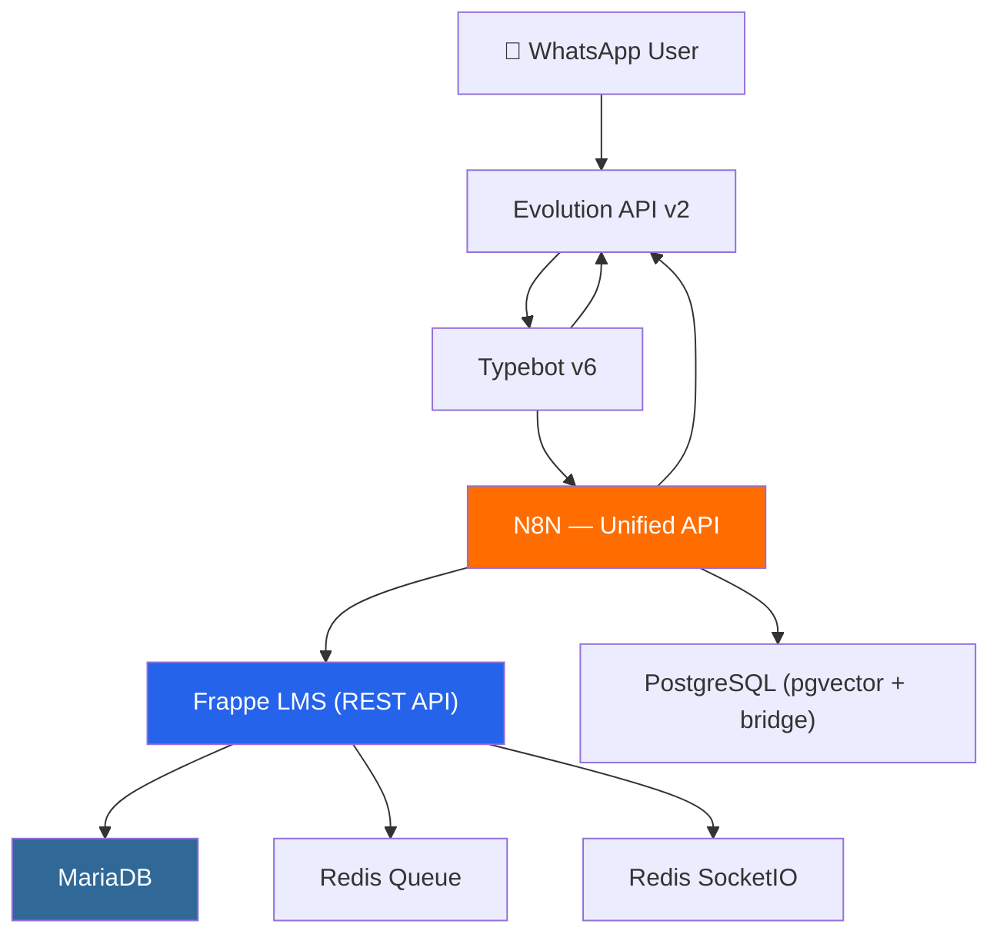

# Arquitetura — Territórios de Desenvolvimento Social e Inclusão Produtiva

## Diagrama de Componentes



## Serviços Docker

| Container | Imagem | RAM | Função |
|-----------|--------|-----|--------|
| `kreativ_frappe_backend` | `kreativ_frappe_lms:latest` | **4GB** | Gunicorn + Frappe workers |
| `kreativ_frappe_frontend` | `kreativ_frappe_lms:latest` | 512MB | Nginx (assets estáticos) |
| `kreativ_frappe_mariadb` | `mariadb:10.6` | 512MB | Banco de dados do Frappe |
| `kreativ_frappe_socketio` | `frappe/frappe-socketio` | 128MB | WebSocket real-time |
| `kreativ_frappe_scheduler` | `kreativ_frappe_lms:latest` | 128MB | Cron jobs internos |
| `kreativ_frappe_queue_short` | `kreativ_frappe_lms:latest` | 256MB | Worker filas curtas |
| `kreativ_frappe_queue_long` | `kreativ_frappe_lms:latest` | 256MB | Worker filas longas |
| `kreativ_frappe_redis_queue` | `redis:7-alpine` | 64MB | Redis para filas |
| `kreativ_frappe_redis_socketio` | `redis:7-alpine` | 64MB | Redis para WebSocket |
| **TOTAL** | | **~5.9GB** | |

## Fluxo de Dados

```
1. WhatsApp → Evolution API → Typebot (fluxo visual)
2. Typebot → N8N webhook (lógica de negócio)
3. N8N → GET/POST Frappe REST API (CRUD acadêmico)
4. N8N → PostgreSQL pgvector (RAG / bridge phone→email)
5. Frappe → MariaDB (persistência LMS)
6. Resposta → Typebot → Evolution → WhatsApp
```

## Rede Docker

- `kreativ_education_net` — rede interna entre serviços Frappe
- `coolify` — rede externa para Traefik (SSL/proxy reverso)
